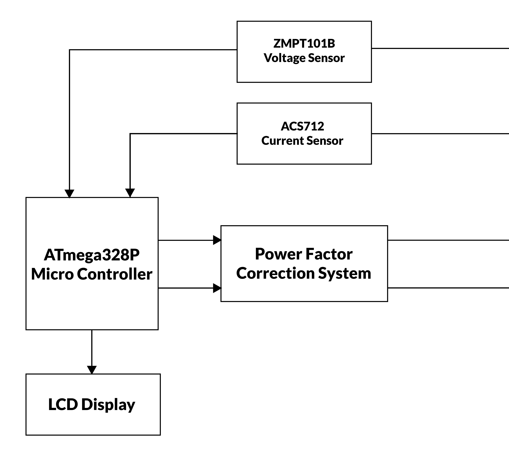

# ⚡ Automatic Power Factor Correction (APFC) System

This project implements an **Automatic Power Factor Correction (APFC)** system using an **Arduino**, voltage and current sensors, and **relay-controlled capacitor and inductor banks**.  
The system continuously measures the power factor of an AC load, detects phase difference through **zero-crossing**, and automatically switches capacitor banks to improve low power factor.

## 🚀 Features
- Real-time **voltage and current measurement**
- **Zero-crossing detection** for phase angle estimation  
- Full electrical parameter calculation:
  - Real Power (P)
  - Reactive Power (Q)
  - Apparent Power (S)
  - Power Factor (PF)
  - Required Reactive Power for correction
- Automatic capacitor bank switching  
- Live PF monitoring via Serial / LCD
- 
## 📘 Project Overview

Power factor is a key parameter in AC power systems. A low power factor increases current consumption and reduces system efficiency.  
This project improves power factor by:

1. Sampling voltage and current waveforms  
2. Detecting phase difference (lag/lead)  
3. Calculating real-time power parameters  
4. Switching capacitor banks to supply reactive power  
5. Bringing PF closer to **unity**

# 📐 Mathematical Model & Equations

## 1️⃣ RMS Voltage & RMS Current

RMS (Root Mean Square) values of voltage and current:

$$
V_{rms} = \sqrt{\frac{1}{N} \sum_{i=1}^{N} v_i^2}
$$

$$
I_{rms} = \sqrt{\frac{1}{N} \sum_{i=1}^{N} i_i^2}
$$

## 2️⃣ Zero-Crossing Phase Angle Calculation

Let:

- $$\( t_v \)$$ = time of voltage zero crossing  
- $$\( t_i \)$$ = time of current zero crossing  
- $$\( T = \frac{1}{f} \)$$ = time period of AC supply

Then the phase angle is:

$$
\phi = 2 \pi \cdot \frac{(t_i - t_v)}{T}
$$

> For lagging loads, current lags voltage → \( \phi > 0 \)

## 3️⃣ Instantaneous Power

Instantaneous power:

$$
p(t) = v(t) \cdot i(t)
$$

Average Real Power:

$$
P = \frac{1}{N} \sum_{i=1}^{N} p_i
$$

## 4️⃣ Apparent Power

$$
S = V_{rms} \cdot I_{rms}
$$

## 5️⃣ Reactive Power

Using trigonometry:

$$
Q = \sqrt{S^2 - P^2}
$$

Or equivalently:

$$
Q = V_{rms} I_{rms} \sin \phi
$$

## 6️⃣ Power Factor

$$
PF = \cos \phi = \frac{P}{S}
$$

- PF < 1 → lagging (inductive)  
- PF > 1 → leading (capacitive)  

## 7️⃣ Required Reactive Power for Correction

To correct from \( PF_1 \) to \( PF_2 \):

$$
Q_c = P \left( \tan(\cos^{-1}(PF_1)) - \tan(\cos^{-1}(PF_2)) \right)
$$

This is the required **capacitive reactive power**.

## 8️⃣ Required Capacitor Size

The capacitor required to supply \( Q_c \):

$$
C = \frac{Q_c}{2 \pi f V^2}
$$

Where:  
- \( C \) = capacitance (farads)  
- \( f \) = AC frequency (Hz)  
- \( V \) = RMS voltage

## 🛠️ Hardware Components

| Component | Description |
|----------|-------------|
| Arduino (Uno/Nano) | Main microcontroller |
| ZMPT101B | Voltage sensor |
| SCT-013 | Current sensor |
| Zero-cross detector | For phase measurement |
| Relay module | Controls capacitor banks |
| Capacitor bank | Adds reactive power |
| LCD / Serial monitor | For live output |

---

## 🔧 System Architecture

---

## ▶️ Usage

1. Upload code to Arduino  
2. Connect sensors and relay board  
3. Power the system  
4. Observe PF, voltage, current on serial/LCD  
5. System automatically switches capacitors

---

## 📊 Results

- PF improved from lagging → near unity  
- Automatic reaction under changing loads  
- Stable & real-time power parameter output  

(Add your results images here)

---

## 📸 Demo / Images

Include system pictures, diagrams, screenshots here.

---

## 📜 License  
MIT License (or any license you prefer)

---

## 👨‍💻 Author  
**Thushanth**  
Electrical & Electronic Engineering Undergraduate  
Passionate about IoT, DSP, embedded systems, AI  
AIESEC LCVP Marketing | Production Head (NST)

